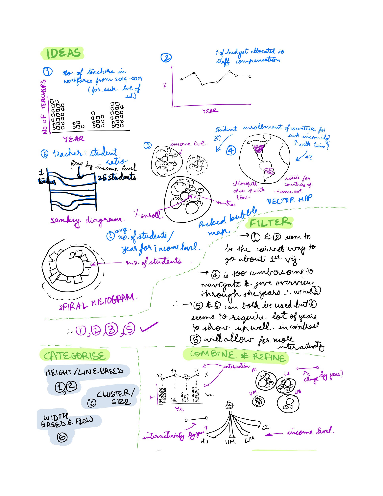
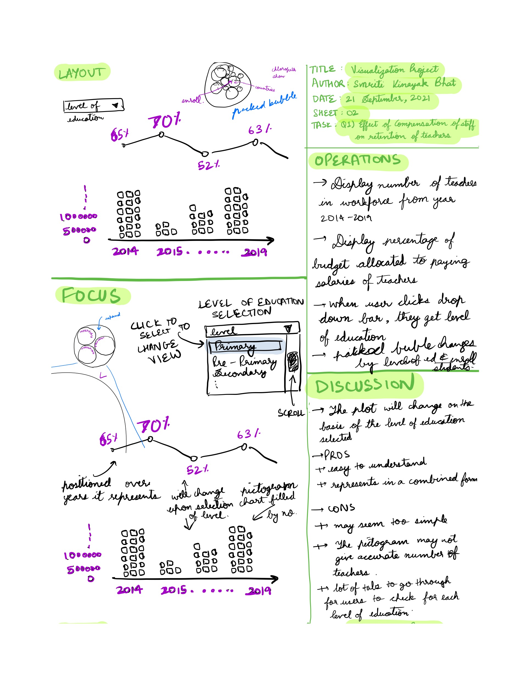
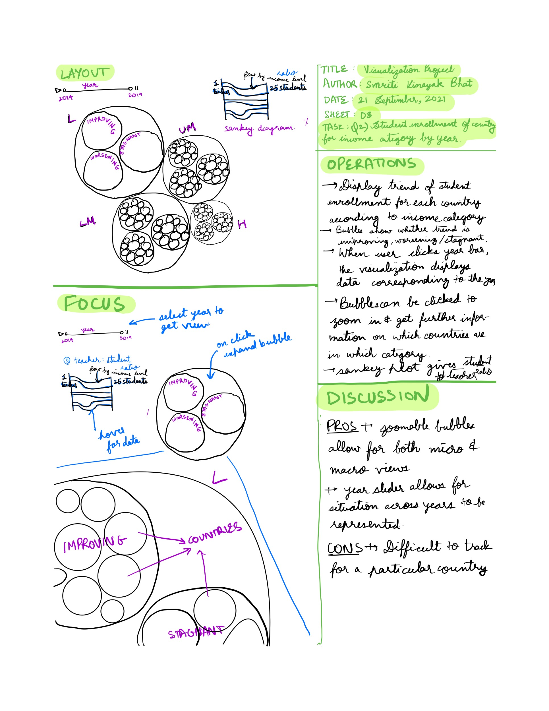
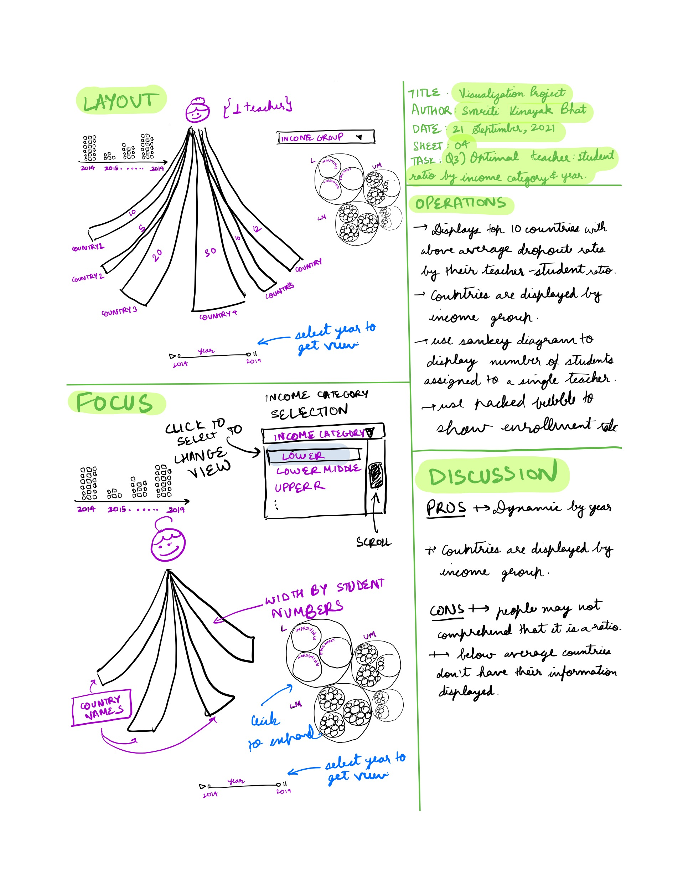
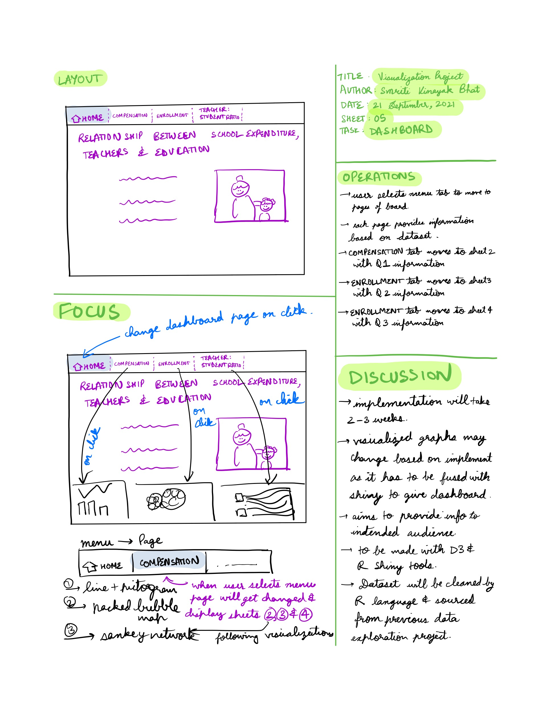

```{r setup, include=FALSE}
knitr::opts_chunk$set(echo = FALSE)
```

#   Introduction

The narrative visualization is based on 3 different components of education -

-   Enrollment of Students
-   Optimal Teacher:Student Ratio
-   Compensation and Retention of Teachers

This visualization was intended to allow for interactive understanding of how the situation is with each of these components. There is space for self exploration of data to allow for self realization.

While in recent years many efforts have been made to improve the system of education, there is still space for efficiency while keeping practicality in mind. This is an important topic for policy makers and educators worldwide.

##    Compensation and Retention of Teachers

This part allows for people to understand how the percentage of school budget being used as compensation is possibly affecting number of teachers available in workforce. The pertinent points of findings are conveyed in the sidebar.

### Points of interest

-   The compensation of staff hasn't remained as much of a priority as before. **There is a sharp dip in 2019 with regards to percentage of budget allocated to compensation.**

-   This dip is also being reflected in the average number of teachers in the workforce across countries for the years 2014-2019. There is a **sharp fall in the average number of teachers post 2017**.

-   There is less percentage of the budget allocated when higher in levels of education. This **could be correlated with the probability that there are lesser students to teach in each level**. However it makes one doubt whether quality of education can be maintained by reducing spending. The **quality of teachers increases in importance with the education level but this need is not reflected within budgetary expenditure.**

##    Enrollment of Students

This part represents the changing enrollment rate of students in countries belonging to different income groups across years 2014-2018. It is equipped to visually represent what the overall situation looks like across the world for each year by changing dropdown value. The radius of circles correspond to enrollment rates of students.

### Points of interest

-   The higher number of large circles corresponding to income group seems to reflect that the **higher the income of the country, the higher is the percentage of children enrolled within schools**. This does seem obvious as schooling is costly and can be considered a privilege.

-   However what is **surprising is that the percentage of children in schools has dipped in high income countries in 2018.** While the dip is not highly significant, this either reflects lack of data from high income countries or means that a certain portion is choosing not to attend schools at all or home schooling.

##    Optimal Teacher:Student Ratio

This part shows a Sankey Network interaction to show the number of students being taught by a single teacher on an average for some of the top countries of an income group. Each set of flow interactions are labeled by income group they belong to.

### Points of interest

-   The higher income countries have the lowest number of students being taken care of by a single teacher across most years.
-   **The income level of the country is inversely proportional to the number of students for a teacher.**
-   The key finding however is the **gap between the upper two levels and the lower two levels of income**. There is a stark contrast in quality of education.

#   Design

The visualization design process for this project was carried out with the help of the 5 design-sheet (FdS) approach.

The FdS for this process are contained within the [Appendix].

## Sheet 1

[Sheet 1][Sheet 1] consists of the sections -

-   Ideas
-   Filter
-   Categorise
-   Combine and Refine

### Ideas

A number of ideas were considered such as  - 

1.   Pictogram
2.   Line Plot
3.   Sankey Diagram
4.   Vector Map
5.   Packed Bubble Map
7.   Spiral Histogram

### Filter

The above ideas were filtered on the basis of - 

-   Discriminability
-   Accuracy
-   Salience 
-   Interactivity

1.    Pictogram: This provides us with accuracy in comparison due to fill of large numbers.
2.    Line Plot: This allows for quite a bit of discriminability as multiple points can be plotted without causing confusion.
3.    Sankey Diagram: Allowed for continuity while grouping(Gesalt Laws).
4.    Vector Map: It scores high on interactivity however low on discriminability and salience. It can encode large number of values but is difficult to analyse. So this idea is filtered out.
5.    Packed Bubble Map: This idea is highly interactive while providing for salience.
6.    Spiral Histogram: This plot is unable to direct and hold attention so it wasn't picked.

###   Categorise

-   Height/Line Based: Pictogram and line plots.
-   Cluster/Size: Packed Bubble Map.
-   Width based/Flow: Sankey Diagram.

###   Combine and Refine

-   This section shows the thought of possibly combining line plot with pictogram with years as the common axis. This is a type of shared fate between both.
-   There is also representation of using dropdown bars or sliders for interactivity.

##    Sheet 2

[Sheet 2][Sheet 2] shows a prototype of visualizations to be picked for possibly answering the question about enrollment rates and effect of compensation. Three visualizations were considered for this -

1.    Line plots
2.    Pictograms
3.    Packed bubble map

##    Sheet 3

[Sheet 3][Sheet 3] shows a prototype of visualizations to be picked for possibly answering the question about teacher:student ratio and enrollment rates. Two visualizations were considered for this -

1.    Sankey diagram
2.    Packed bubble map

##    Sheet 4

[Sheet 4][Sheet 4] shows a prototype of visualizations to be picked for possibly answering the question about enrollment rates, teacher:student ratio and effect of compensation. Three visualizations were considered for this -

1.    Sankey Network
2.    Pictogram
3.    Packed bubble map

###   Sheet 5

[Sheet 5][Sheet 5] focuses more on the general layout and helps illustrate the final narrative that was decided upon.

#### Visualizations Picked

1. Pictogram + Line Plot
2. Packed Bubble Map
3.    Sankey Network

#### Narrative chosen

-   Narrative style chosen is reader-driven.
-   The dashboard created will follow something akin to a slideshow format as you click through and open tabs.
-   This is an interactive slideshow format as within each slide there is provision for readers to click through, interact and explore so it is a hybrid narrative visualization.
-   This narrative style has been chosen to give the users autonomy to take their time to go through every element of data and draw their own conclusions and not just from the conclusions given by the creator of the shiny application.

###     Decision Choice Justification

1.    Pictogram + Line Plot:
-   Pictogram and line plot was combined with a shared fate concept with position on a common scale to allow people to understand that they are events that occur in the same timeline.
-   The spatial regions and color hues help distinguish by year. While the year drop down enables for interactivity by user.
2.    Packed Bubble Map:
-   The packed bubble map was chosen as proximity grouping is visible enabling readers to realize where the data belongs to. Thus they would be able to correlate grouping by income group for circles.
-   Area attribute enables people to compare enrollment rates while color hue represents categorical attribute about whether the rate is improving, worsening or stagnant. It was ensured that improving category was given a green shade, worsening was given a red shade and stagnant was given a black colour on purpose due to the implication of these colours.
-   The bubbles were given further interactivity for hover and bounce to allow the users to find a childish sense of joy in interacting with the bubble and possibly find more patterns that one might not spot otherwise. 
3.    Sankey Network Diagram:
-   The sankey network allows users to recognize continuity of flow from one teacher to groups of students of multiple countries within an income group.
-   The color hue allows one to group by income while continuity (Gesalt Law) helps viewers to perceive regions and line to form continuous shapes. The color palette was chosen with aesthetic pastel colors to be pleasing to the eye.

#   Implementation

##    Softwares Used

-   R Shiny in conjunction with flexdashboard
-   D3

##    Libraries Used

The below libraries were used - 

1.    tidyverse
2.    flexdashboard
3.    shiny
4.    ggplot2
5.    waffle
6.    hrbrthemes
7.    r2d3
8.    networkD3

##    Templates Used

-   This [code](https://github.com/hrbrmstr/waffle) was used to figure out how to build pictogram using waffle package for my purposes.
-   This [code](https://bl.ocks.org/HarryStevens/f636199a46fc4b210fbca3b1dc4ef372) was used as base sample code to achieve D3 visualization.
-   This [code](https://www.d3indepth.com/force-layout/) was also used to understand how to group and jitter for income group in the D3 visualization.
-   This [code](https://www.r-graph-gallery.com/323-sankey-diagram-with-the-networkd3-library.html) was used to understand how to reproduce Sankey diagram after wrangling data to achieve node and link data frames.

##    Difference between Design and Implementation

-   Circle packing and zooming functionalities in D3 to show the visualization for enrollment rate were not achieved. Instead the visualization represents grouping for income level by spatial position.
-   The sliders for years have been replaced with drop downs as they seemed more optimal.

##    Challenges

-   Aligning the pictogram with line plot such that the years were represented by a common axes created some issues. The flexdashboard format as well as axes had to be set for this.
-   The D3 required filtering of data within itself for data. Converting the data into circles while enabling for force to ensure they bounce back also shows advance usage. 
-   The Javascript also ensures that the countries with higher enrollment rate are towards the center while the smaller ones are towards the edges.
-   There is also mouseover and mouse drag functionality. All these together display advanced functionality.
-   The sankey network required wrangling for obtaining the correct nodes and links data frames for usage. The sankey diagram also displays data on hover.
-   All visualizations have drop down reactive behavior.

#   User Guide

Click on different tabs for the visualizations:

##    Compensation

-   Use drop down to choose _Level of Education_ and view data for the level.
-   The year axes is common to both line plot as well as pictogram.
-   The labels of line plot display percentage of budget used for compensation.

##    Enrollment

-   The drop down will allow you to choose the year for the visualization of data to be visible.
-   There is _mouseover_ and _mouse drag_ functionality:
1.    **Mouseover**: Hovering over a circle will let you know country name, income group it belongs to and whether the enrollment rate is worsening, improving or stagnant. The colour palette of the circles also matches the enrollment rate status.
2.    **Mouse drag**: The circles can be dragged around and placed anywhere within the group. If they are dragged outside the group then they will be forced back into the group no matter how far they are dragged.
-   The larger circles are towards the center while the smaller ones are forced outwards.
-   The text above each clump stands for the income group they belong to.

##    Teacher:Student Ratio

-   The drop down will allow you to choose the year for the sankey diagram of data to be visible.
-   Hovering over each flow will let you know which income group the country belongs to and how many students are assigned per teacher.
-   The nodes can be moved around the page within the same vertical line.

#   Conclusion

##    Findings

-   The overall situation seems to be improving worldwide for education.
-   The low income countries require more aid in coming out of their slump.
-   It is also crucial to check how higher income countries still have low enrollment rates.
-   Slump in compensation provided to teachers seems to have a direct impact on their numbers. More teachers are required in the workforce.
-   The more prosperous countries seem to have smaller teacher:student ratio so the focus needs to be on training more teachers and allowing for this ratio to become more optimal for countries in all income groups.

##    Learnings

Some personal learnings by creator:

-   D3 visualization
-   Sankey Diagram
-   Pictograms

In hindsight:

-   There could have been sliders replacing the drop down in certain spaces.
-   The drop down could have been made with D3 instead of Shiny.

##    Future Work

-   Convert Shiny drop down for Enrollment tab to D3 entirely and eliminate it from sidebar.
-   Convert data into json in order to implement circle packing and zooming.

#   Bibliography

##    Libraries Used

Wickham et al., (2019). Welcome to the tidyverse. Journal of Open Source Software, 4(43), 1686, https://doi.org/10.21105/joss.01686

Richard Iannone, JJ Allaire and Barbara Borges (2020). flexdashboard: R Markdown Format for Flexible Dashboards. R package version 0.5.2. https://CRAN.R-project.org/package=flexdashboard

Winston Chang, Joe Cheng, JJ Allaire, Carson Sievert, Barret Schloerke, Yihui Xie, Jeff Allen, Jonathan McPherson, Alan Dipert and Barbara Borges (2021). shiny: Web Application Framework for R. R package version 1.7.1. https://CRAN.R-project.org/package=shiny

H. Wickham. ggplot2: Elegant Graphics for Data Analysis. Springer-Verlag New York, 2016.

Bob Rudis and Dave Gandy (2019). waffle: Create Waffle Chart Visualizations. R package version 1.0.1. https://gitlab.com/hrbrmstr/waffle

Bob Rudis (2020). hrbrthemes: Additional Themes, Theme Components and Utilities for 'ggplot2'. R package version 0.8.0. https://CRAN.R-project.org/package=hrbrthemes

Nick Strayer, Javier Luraschi and JJ Allaire (2020). r2d3: Interface to 'D3' Visualizations. R package version 0.2.5. https://CRAN.R-project.org/package=r2d3

J.J. Allaire, Christopher Gandrud, Kenton Russell and CJ Yetman (2017). networkD3: D3 JavaScript Network Graphs from R. R package version 0.4. https://CRAN.R-project.org/package=networkD3

##    Data Sources

The World by Income and Region. n.d. World Bank. https://datatopics.worldbank.org/world-development-indicators/the-world-by-income-and-region.html.

Welcome to UIS.stat. 2021. UNESCO. http://data.uis.unesco.org/Index.aspx.

##    Code Templates

Force layout. D3 in Depth. (2021, May 14). Retrieved October 27, 2021, from https://www.d3indepth.com/force-layout/.

Force simulation. Popular Blocks. (n.d.). Retrieved October 27, 2021, from https://bl.ocks.org/HarryStevens/f636199a46fc4b210fbca3b1dc4ef372. 

Holtz, Y. (n.d.). Sankey diagram for Energy Consumption. – the R Graph Gallery. Retrieved October 27, 2021, from https://www.r-graph-gallery.com/323-sankey-diagram-with-the-networkd3-library.html. 

Hrbrmstr. (n.d.). HRBRMSTR/Waffle: Make Waffle (square pie) charts in R. GitHub. Retrieved October 27, 2021, from https://github.com/hrbrmstr/waffle. 

#   Appendix

##    Sheet 1

```{r, out.width="90%"}

```

##    Sheet 2

```{r, out.width="100%"}

```

##    Sheet 3

```{r, out.width="100%"}

```

##    Sheet 4

```{r, out.width="100%"}

```

##    Sheet 5

```{r, out.width="100%"}

```
